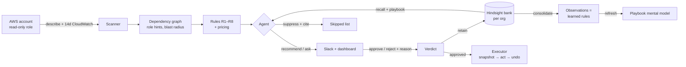
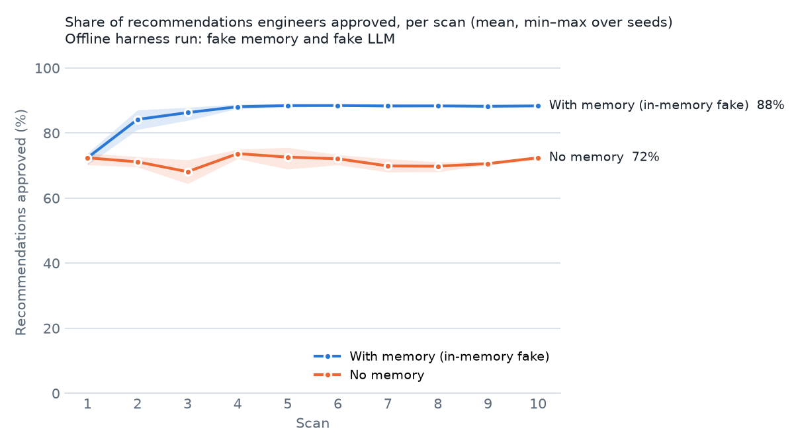

# CloudSense

**Cost tools tell you what to delete. CloudSense learns what you'll never let it delete.**

Every cloud cost tool recommends deletions, and engineers ignore most of them. The tool can't know that the "idle"
box is the disaster-recovery standby, or that the "oversized" worker spikes at month-end payroll. Each bad
recommendation costs trust until nobody reads the channel. CloudSense turns every "no, because…" from an engineer
into a durable, evidence-backed rule stored in [Hindsight](https://github.com/vectorize-io/hindsight) agent memory,
applies it to resources it has never seen (including untagged look-alikes), and gets measurably more trustworthy
with every review.

 <!-- placeholder: record with the demo script in docs/BUILD_DOC.md section 17 -->

## How it works



Scan → candidates → agent (recall + playbook) → human verdict → **retain** → Hindsight consolidates observations →
the playbook refreshes → the next scan is smarter.

## How Hindsight memory is used

| Hindsight feature | What CloudSense does with it | Where |
|---|---|---|
| Memory bank per org | Tenant isolation: bank `org-{id}` | [`types.py#L70`](backend/memory/types.py#L70) |
| Mission, disposition | "Breaking production is worse than missing a saving"; skepticism 5, literalism 4 | [`setup.py#L7`](backend/memory/setup.py#L7), [`setup.py#L32`](backend/memory/setup.py#L32) |
| Directives | The org's written hard rules (Settings page) become bank directives; also enforced as a pre-filter before the LLM | [`setup.py#L41`](backend/memory/setup.py#L41), [`decide.py#L22`](backend/agent/decide.py#L22) |
| `retain` | Every verdict, approvals included, with context, timestamp, entities, tags and an idempotent `document_id` | [`types.py#L97`](backend/memory/types.py#L97), [`client.py#L49`](backend/memory/client.py#L49) |
| `recall` | Before each decision, in parallel (8 at a time), queried by action, name, role hints, signals and neighbours | [`types.py#L118`](backend/memory/types.py#L118), [`client.py#L60`](backend/memory/client.py#L60) |
| Observations | The Learned Rules page: consolidated rules with proof counts and source verdicts | [`client.py#L99`](backend/memory/client.py#L99) |
| Mental model | `org-playbook`: untagged, refreshed after consolidation in delta mode, structured output for UI chips; injected into the agent's system prompt | [`setup.py#L23`](backend/memory/setup.py#L23), [`client.py#L76`](backend/memory/client.py#L76) |
| Mental model history | Playbook page version diff | [`client.py#L85`](backend/memory/client.py#L85) |
| `reflect` | "Why?" buttons in Slack and the dashboard, and the Ask page, with `based_on` sources | [`client.py#L93`](backend/memory/client.py#L93) |
| Tags + `observation_scopes` | `[[], [account:x], [team:y]]`: org-wide rules that transfer to new accounts, plus per-account and per-team rules | [`types.py#L97`](backend/memory/types.py#L97) |
| Operations API | Wait for consolidation, then show "Rule learned (confirmed N×)" in Slack and the queue | [`client.py#L125`](backend/memory/client.py#L125), [`service.py#L79`](backend/review/service.py#L79) |
| Cold start | 10 common exceptions a new org can accept, retained as `org policy seed` | [`templates.py`](backend/memory/templates.py) |
| Memory safety | Only reviewers/admins can teach; provenance on every rule; admins remove a poisoned rule by invalidating its source facts | [`service.py#L47`](backend/review/service.py#L47), [`client.py#L117`](backend/memory/client.py#L117) |

SDK signatures were verified against `hindsight-client` 0.10.1; where they differ from the original design, see
[`docs/HINDSIGHT_NOTES.md`](docs/HINDSIGHT_NOTES.md).

## Quickstart

**Try it with no accounts at all** (fake memory and LLM, the eval environment's accounts instead of AWS):

```bash
make install
make demo          # API on :8000
make frontend      # dashboard on :5173, pick a user in the header, then "Run a scan"
```

**Real setup**

1. `cp .env.example .env` and fill in `HINDSIGHT_BASE_URL`, `HINDSIGHT_API_KEY`, `GROQ_API_KEY`,
   `CLOUDSENSE_PRINCIPAL_ARN` and (optionally) the Slack tokens. Keep `DRY_RUN=true` until you've watched a dry run.
2. `docker compose up` (API on :8000, dashboard on :4173). Add `--profile slack` for the Slack worker.
3. Seed a sandbox account a few days ahead, so CloudWatch has history: set a
   [$10 billing alarm](infra/billing-alarm.md), then `make seed REGION=us-east-1`.
4. Connect the account: deploy [`infra/cloudsense-readonly.yaml`](infra/cloudsense-readonly.yaml) with the
   ExternalId shown in **Settings**, and paste the `RoleArn` output. For executing approved actions, also deploy
   the opt-in [`infra/cloudsense-action.yaml`](infra/cloudsense-action.yaml).
5. Run a scan from **Overview**, review in the **Queue** or in Slack.
6. Slack: create an app with Socket Mode and Interactivity, bot scopes `chat:write` and `chat:write.public`, invite
   it to `SLACK_REVIEW_CHANNEL`, set `users.slack_id` for reviewers (the demo seed uses `U00REVIEW`), then run
   `python -m backend.review.slack_app`.
7. Measure Hindsight consolidation latency before relying on it live: `make smoke-memory`.

`make test` runs the Python suite (moto for AWS, in-memory fakes for Hindsight, Groq and Slack) and the frontend build.
`make sim` plays the whole demo story end to end through the API; `make sim-live` does the same against your real
Hindsight and Groq keys (AWS stays simulated by moto, so it costs nothing).

## Eval: does memory actually help?

The original CloudSense RL environment is kept as an offline benchmark ([`eval/`](eval)). A simulated engineer
rejects recommendations on six trap archetypes (DR standby, payroll batch, audit archive, blue/green standby,
license-pinned host, on-call debug host) plus the environment's critical resources. Across 10 scans and 3 accounts
the traps reappear under **new names and mostly without tags**, so hard rules alone can't catch them.



The committed plot is the **offline harness run** (`make eval-fake`: keyword-overlap memory and a rule-following
fake LLM). It shows the harness works: without memory, acceptance stays near 71%; with memory it rises to about 88%
by the fourth scan as trap hits drop. It is **not** a measurement of Hindsight + Groq. Run `make eval` with real
credentials (fresh bank per seed) to produce that, and replace the plot.

## Safety model

- **Read-only by default.** Scanning uses a role with describe/metrics permissions only, assumed with a per-org
  ExternalId. No keys are stored.
- **Dry run by default** (`DRY_RUN=true`): approved actions return the exact AWS calls they would make.
- **No action without an approved verdict**, and every action is written to the audit log with who approved it.
- **Reversible first:** volumes are snapshotted before a stop or delete; deletes wait for the snapshot to complete,
  and the action role can only delete volumes tagged `cloudsense:approved=true`. Every executed action has an undo.
- **IaC-managed resources** (`created_by=terraform`, CloudFormation tags) are never mutated: CloudSense returns a
  Terraform diff for a pull request instead.
- Irreversible actions (release an EIP, delete a snapshot) and S3 lifecycle changes stay recommend-only.

## Limitations

- **Consolidation latency.** Observations form asynchronously; the UI shows "Learning…" until they do. Measure it
  with `make smoke-memory`.
- **Cold start.** An empty bank knows nothing; the starter rules in Settings help, but the first scans rely on
  signals and hard rules.
- **Savings are estimates** from a bundled us-east-1 price list, not reconciled with Cost Explorer.
- **Demo-grade auth.** Users are picked with an `X-User-Id` header. Put SSO in front before real use.
- **RDS stops are temporary**: AWS restarts a stopped instance after 7 days. CloudSense logs a reminder, and
  recommends snapshot + delete for databases that are truly dead.
- Memory utilization is unknown without the CloudWatch agent, so rightsizing uses CPU only.

## Repository layout

```
backend/   FastAPI app: scanner, graph, candidates, agent, memory, review (Slack), actions, store, api
frontend/  React + Vite dashboard: Overview, Queue, Graph, Learned rules, Playbook, Ask, Settings
infra/     CloudFormation roles, sandbox seed/teardown, look-alike launcher, billing alarm
eval/      the original RL environment + simulated engineer + memory-vs-no-memory eval
docs/      build spec, migration plan, Hindsight SDK notes
```

## Links

- Hindsight on GitHub: https://github.com/vectorize-io/hindsight
- Hindsight docs: https://hindsight.vectorize.io/
- What is agent memory: https://vectorize.io/what-is-agent-memory
